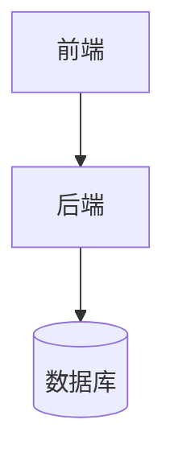

# Thesis Diagramming Strategy

## Priority

1. Use draw.io MCP when available for final-quality diagrams.
2. If draw.io MCP is unavailable, create diagrams.net-compatible `.drawio` XML source files for thesis diagrams and reference those files from the Markdown placeholders.
3. For a Word-convertible final thesis, do not leave structural figures as raw Mermaid-only content in the final body. Mermaid is only a private drafting aid unless the user explicitly asks for Mermaid output.

The draw.io MCP project supports multiple approaches, including a hosted MCP App Server at `https://mcp.draw.io/mcp`, an npm tool server via `npx @drawio/mcp`, and generation of `.drawio` files through a Skill + CLI workflow. Do not assume any of these are installed. Detect or ask only when necessary; otherwise provide `.drawio` sources and placeholders.

For Word-convertible undergraduate theses, prefer compact diagrams that match A4 portrait pages. Long vertical flowcharts usually look sparse or overflow in Word; replace them with horizontal swimlanes, staged matrices, two-row pipelines, grouped component blocks, or split subfigures. Avoid Mermaid `mindmap` for formal deliverables because support varies across renderers.

When the user asks for all figures to be draw.io, convert every non-screenshot structural figure in the target chapters to `.drawio`: use-case, activity, sequence, state, DFD, E-R, architecture, module, component, class, deployment, navigation, and algorithm workflow diagrams. Keep UI and testing figures as screenshot placeholders with captions.

## Academic Visual Style

Use a clean thesis style rather than a presentation-poster style:

- Prefer white background, thin neutral strokes, restrained blue/green/gray accent colors, and flat vector shapes.
- Use UML and systems symbols consistently: actor, boundary, control, entity, database cylinder, service component, message arrow, swimlane, package, and cloud only when the verified architecture requires them.
- Keep node labels short, usually 4 to 10 Chinese characters. Move explanation into the caption or body text instead of filling the shape.
- Avoid decorative gradients, heavy shadows, photos, cartoon icons, oversized emojis, and large empty canvases.
- For dense flows, use lanes, grouped blocks, or numbered stages so one diagram fits within roughly half to one A4 page when exported to Word.

## Required Thesis Diagrams

For system-design theses, strongly consider:

- System architecture diagram.
- Functional module diagram.
- Core business flowchart.
- Core intelligent-agent/tool-call workflow diagram.
- Login sequence diagram.
- Chat/WebSocket sequence diagram.
- PDF export/archive sequence diagram.
- E-R diagram.
- Deployment diagram if deployment evidence exists.
- Class/package diagram if code structure is important.

## Diagram Truth Rules

- Use only modules, tables, APIs, classes, and services found in code or user materials.
- Do not copy diagrams from reference templates unless the structure truly matches the project.
- Do not include unsupported external services or databases.
- For uncertain deployment details, label the diagram as simplified or mark as "待补充".

## draw.io MCP Usage Pattern

When a draw.io MCP tool is available:

1. Search shapes first for cloud, database, UI, API, or UML icons if the tool supports shape search.
2. Create diagram source from verified project architecture.
3. Export or reference a durable `.drawio`, `.svg`, or `.png` artifact if the tool supports it.
4. Insert the Markdown placeholder and artifact path:

`[此处插入：图5-1 系统总体架构图 - 文件：docs/figures/system-architecture.drawio.png]`

If the MCP only returns XML/text, embed a compact XML source block or save the XML source as an artifact when feasible.

## Drafting-Only Mermaid Pattern

Mermaid can be used internally to reason about simple structure, but it should not be the final visible figure format for a polished thesis unless the user explicitly requests it:

Then replace it with a draw.io source and add:

`[此处插入：图X-X 图名 - 说明；正式成稿建议使用 draw.io 源文件 docs/drawio/图X-X_图名.drawio 导出为 PNG 或 SVG 后插入]`

## Caption Rules

Use reference-template style:

- Figure captions: `图 5-1 系统总体架构图`.
- Table captions: `表 5-1 用户表结构`.
- Keep numbering sequential inside each chapter.
- Avoid captions that describe unsupported behavior.
- Every screenshot placeholder and every diagram placeholder must have a caption. Never leave an image, exported diagram, or placeholder without a figure number and title.

## Major Diagram Placeholder

For major diagrams, create or reference a `.drawio` file instead of leaving the body as Mermaid-only:

`[此处插入：图X-X 图名 - 功能说明；正式成稿建议使用 draw.io 源文件 docs/drawio/图X-X_图名.drawio 导出为 PNG 或 SVG 后插入]`
